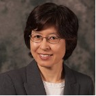

# Mask Day Predictor

"Unprecedented," "difficult time," these are the words we often hear recently with Covid19 outbreak. In this uncertain world, Mask Day Predictor lets you make informed decisions about your daily activities by telling you whether the outbreak is happening near you and how intense it might be.

We apply machine learning and Natural Language Analysis to the words in tweets that might indicate COVID-19 infection such as "fever" and "shortness of breath." This method is about 75% effective at predicting flu outbreak based on a research paper published last year.  Our application’s analysis outcomes become available to you through API, which interacts with Alexa, phone, and browsers.

With this application at hand, you no longer need to guess whether you should wear a mask that day or whether you should stay home. In other words, Mask Day Predictor gives you the power to make informed decision about your activities, which also helps you build your own life again in the world with new normal. 

# Meet the Team

## Mika Nagamine, Ph.D.

 Mika's background is clinical social work, which helped her become aware of the impacts of healthcare systems and the importance of research and data. She started her career with Truven Health Analytics (Thomson-Reuters) and developed/maintained HCUP data for 12 states. At LA Care Health Plan, she produced CMS reports, analyzed medical claim data, and developed/maintained backend data for KPI. She currently works at OptumRx developing outcome analyses and quarterly Budget Impact Analyses and analyzing claim data using SAS, Oracle, Teradata, and DB2 in a HIPAA-compliant environment.

Mika was born and raised in Japan. After coming to the US, she became interested in healthcare service research and realized the power of “stories” produced based on data. She loves to fly and hopes to be certified as a private pilot. She was recently certified as a naturalist and enjoy bird watching. She has a Ph.D. in Social Work with a Ph.D. minor in Epidemeology, masters degrees in Social Work and Psychology, and is bilingual in Japanese and English.
